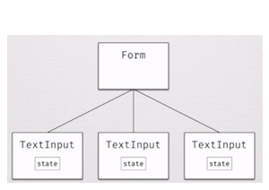
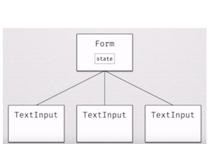
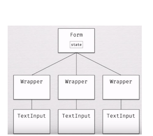

Basic react/redux starter
Routing with react-route-dom 

Setup and ready for redux-form, redux-thunk, axios, firebase

you will need to set up  .env  in ./src

Looks like this


REACT_APP_WEBSITE_NAME= ###-###  

REACT_APP_API_KEY= ###-###  
REACT_APP_AUTHDOMIAN= ###-###  
REACT_APP_DB_URL= ###-###  
REACT_APP_PROJECT_ID= ###-###  
REACT_APP_STORAGE_BUCKET= ###-###  
REACT_APP_MESSY_ID= ###-###  


My Notes on Redux-form
👇  👇  👇  👇  👇  👇  👇  👇  👇  👇  👇  👇  👇  👇  👇  👇  👇  

The tutorial: <https://www.youtube.com/watch?v=ey7H8h4ERHg>

The project files: <https://github.com/erikras/reactalicante2017/tree/master/components>

React Unidirectional Data Flow
==============================

* data flows down from parent to child
* a parent doesn't it’s child for state
* a child can only update state by using a callback given to it by the parent

How does this look in a react form

* User type into an input ...
* Which dispatches an event …
* Updates the value in some canonical data store (sets state)
* Cause the input to be re-rendered
* 

A controlled field/input/form
=============================

The simplest form in react
--------------------------

A controlled input means you are always passing a non null value to the value prop of the input

If you don’t pass a value then the DOM will take over

* initialise the state
* change handler will update with setState with the value found at event.target.value
* we give the value from our sate to the input value

```jsx
import React from 'react';
class FormReactExample extends React.Component {

    state = { value: '' }

    handleChange(event) {
        console.log("event.target.value : ", event.target.value);
        this.setState({ value: event.target.value })
    }

    render() {
        return (
            <form action="">
                <input type="text" value={this.state.value} onChange={this.handleChange.bind(this)}/>
            </form>
        );
    }
}   

export default FormReactExample
```

Why is this no good?
--------------------

If you build a form like this, you end up with each input needs a state, and **when the form goes to submit then the form has to ask for the sate from it’s children which as we know is not good in react**



So the state has to live in the Form and get passed down with props.



This is standard fare in react

* the state lives up high in the tree…
* gets passed to children with props...
* -if the child wants to modify state then it has to send a callback to the parent...

Gets very messy very quickly,



Whats the solution…. Redux & redux-form 👏
==========================================

Redux
-----

* pulls the state higher, almost out of the tree into the redux store
* requires that any mutations to the sate happen through actions and reducers
* means any element in the state tree to can read from the global state and potentially mutate it by calling a action

and then… Redux Form 🎉
-----------------------

Add the best bits of redux to the form, 

Three main qualities

* single reducer you give to redux to handle the state of all the forms in the app
* HOC a function that wraps decorates the forma components and gives you extra props and callback, and form state
* Field component - a component that manages the state for each individual field in the form - gives you the value and callbacks you need. Living inside your wrapped form component; use it to connect the input components to the redux-form logic

some other bits/examples…

* when you add data to a single input in a form —\> in react this would be re-rendering all the inputs, re-rendering everything. With redux-form it is only re-rendering the single input field as it knows this is the nly one that has changed

A simple example of flow 
-------------------------

a simple example. We have a form component wrapped with reduxForm(). There is one text input inside, wrapped with \<Field/\>. The data flows like this:

* User clicks on the input,
* "Focus action" is dispatched,
* formReducer updates the corresponding state slice,
* The state is then passed back to the input.

Same goes for any other interaction like filling the input, changing its state or submitting the form.

With redux-form comes a lot more: hooks for validation and formatting handlers, various properties and action creators. 

4 steps to a simple form
========================

1. install the form reducer
2. create form, decorate it with redux-form and make props accessible
3. add field components in place of from inputs
4. handleSubmit()

### 1\. Install the form reducer

the piece of state for this must must must be form. or nothing will work!!!

```jsx
import { combineReducers } from 'redux';
import PostReducer from './reducerPosts';
import { reducer as formReducer } from 'redux-form';

const rootReducer = combineReducers({
    posts: PostReducer,
    form: formReducer
});

export default rootReducer;
```

### 2\. Create form, decorate it with redux-form and make props accessible 

Look 👀 the form is a **Functional Stateless Component**👇

```jsx
import React from 'react'
import { Field, reduxForm } from 'redux-form'

let ContactForm = props => {
  const { handleSubmit } = props
  return <form onSubmit={handleSubmit}>{/* form body*/}</form>
}

ContactForm = reduxForm({
  // a unique name for the form
  form: 'contact'
})(ContactForm)

export default ContactForm
```

3\. Add field components in place of inputs
-------------------------------------------

This is the easiest way to get a redux-field form on the page. you can use any standard input type in the component attribute and it will know what to do

The field will recieve a bunch of meta data that we will want to use so in a real case scenario you will never want to use use *component= “input”*

*
*

```jsx
  <form onSubmit={handleSubmit}>
      <div>
        <label htmlFor="firstName">First Name</label>
        <Field name="firstName" component="input" type="text" />
      </div>
      <div>
        <label htmlFor="lastName">Last Name</label>
        <Field name="lastName" component="input" type="text" />
      </div>
      <div>
        <label htmlFor="email">Email</label>
        <Field name="email" component="input" type="email" />
      </div>
      <button type="submit">Submit</button>
    </form>
```

handleSubmit()
--------------

one of the redux-form props is handleSubmit()

```jsx
let DemoForm = ({handleSubmit}) =>  ...
```

This will take all the data from the form and pass it on as a JSON object to whatever function we tell it to… in this case submit()

```jsx
<form onSubmit={handleSubmit=(this.submit)} />
```

A set up looks like this on a FSC

```jsx
const submit = (values) => {
    console.log("values : ", values);
}

let DemoForm = ({handleSubmit}) => 
   <form onSubmit={handleSubmit(submit)}>
```

Or with a regular component

```jsx
class ContactPage extends React.Component {
  submit = values => {
    // print the form values to the console
    console.log(values)
  }
  render() {
    return <ContactForm onSubmit={this.submit} />
  }
}
```

RenderInput
===========

In the above examples we have been writin g out the fields as such

```jsx
<label htmlFor="firstName">First Name</label>
<Field name="firstName" component="input" type="text" />
```

But we in the component attribute we can ship this out to a render function

```jsx
const renderInput = field =>   // Define stateless component to render input and errors
    <div>
        <input {...field.input} type={field.type} placeholder={field.placeholder} />
        {field.meta.touched &&
            field.meta.error &&
            <span className="error">{field.meta.error}</span>}
    </div>


let ContactForm = props => {
  const { handleSubmit } = props
  return (
    <form onSubmit={handleSubmit}>
      <label htmlFor="firstName">First Name</label>
      <Field name="firstName" component={renderInput} type="text" />
    </form>
    )
}
```

One of the clever bits in redux-form is to use a simple FSC to render the fields. You can use this over any number of fields you just need to send as props the name, the type and you can additionally add label, placeholder or custom attr

```jsx
const renderInput = field =>   // Define stateless component to render input and errors
    <div>
        <input {...field.input} type={field.type} placeholder={field.placeholder} />
    </div>


let ContactForm = props => {
  const { handleSubmit } = props
  return (
            <div className="field-cont">
              <label htmlFor="number">number</label>
              <Field
                  // Specify field name
                  name="number"
                  // Reuse same render component
                  component={renderInput}
                  // "type" prop passed to renderInput
                  type="number"
                  //placeholder setting
                  placeholder="number"
              />
            </div>
    )
}
```

Validation
==========

Errors
------

**First...** create the validate function that, through a series of if’s will return an object that contains our error

```jsx
const validate = values => {
    const errors = {}
    if (!values.number) {
        errors.number = 'Required'
    }
    if (!values.password) {
        errors.password = 'Required'
    }
    if (!values.tel) {
        errors.tel = 'Required'
    }
    return errors
}
```

**Second..** enter validate in the redux-form HOC decorator

```jsx
MyForm = reduxForm({
    // a unique name for the form
    form: 'myForm',
    validate
})(myForm)
```

**Third… **in renderInput() destructure the props, pull out the method we need… touched and error

touched = the user has focussed the input and left

then we use the *logical AND * operator to check if an input has been *touched AND has error* then prints out error

```jsx
const renderInput = ({ input, placeholder, type, meta: { touched, error } }) =>   (
    <div>
        <input {...input} type={type} placeholder={placeholder} />
        {touched && error && <span className="error">{error}</span>}
    </div>

)
```

Warnings
--------

*Additionally, you can provide redux-form with a warn function with the same type signature as your validation function. Warnings are errors that do not mark a form as invalid, allowing for two tiers of severity for errors.*

Almost the same set up as errors

**First… **create the warn function

****

```jsx
const warn = values => {
    const warnings = {}
    if (values.number < 10) {
        warnings.nnumber = 'Hmm 🤔, we\'d like a # higher than 10!'
    }
    return warnings
}
```

**Second..** enter warn in the redux-form HOC decorator

```jsx
MyForm = reduxForm({
    // a unique name for the form
    form: 'myForm',
    validate,
    warn
})(myForm)
```

**Third… **edit the renderInput()

```jsx
const renderField = ({
  input,
  label,
  type,
  meta: { touched, error, warning }
}) => (
  <div>
    <label>{label}</label>
    <div>
      <input {...input} placeholder={label} type={type} />
      {touched &&
        ((error && <span>{error}</span>) ||
          (warning && <span>{warning}</span>))}
    </div>
  </div>
)
```


